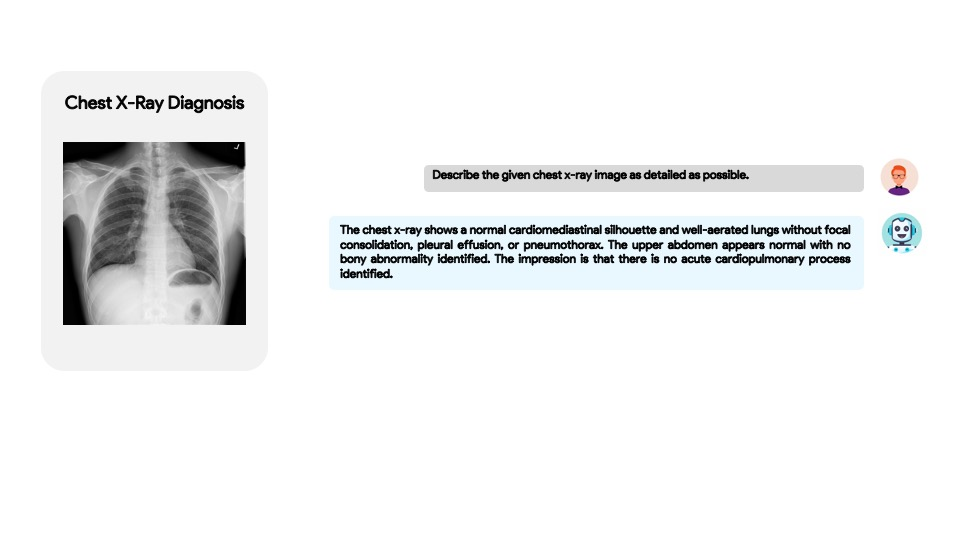
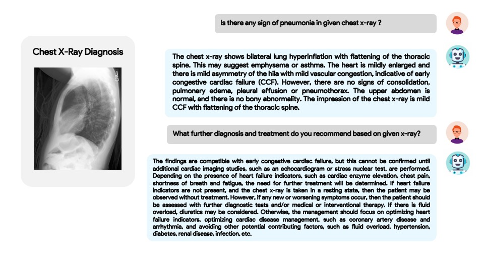
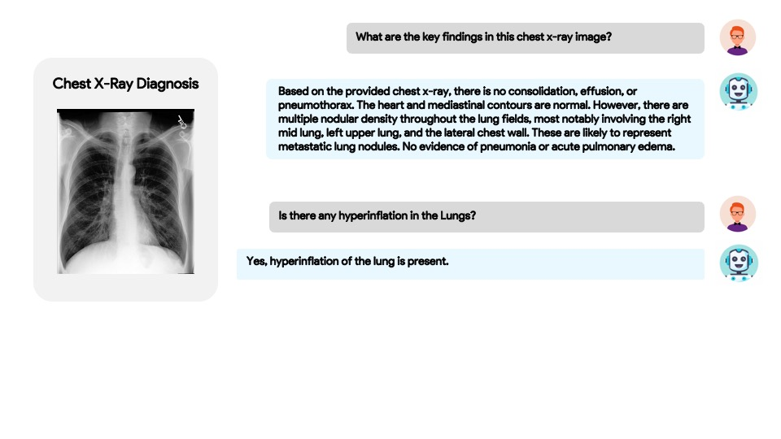
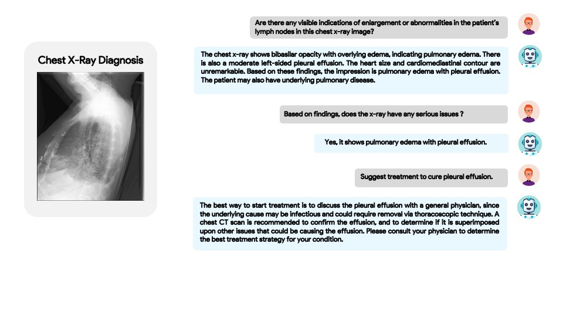

# XrayGPT: Chest Radiographs Summarization using Medical Vision-Language Models.


[Omkar Thawakar](https://omkarthawakar.github.io/)* , [Abdelrahman Shaker](https://amshaker.github.io/)* , [Sahal Shaji Mullappilly](https://scholar.google.com/citations?user=LJWxVpUAAAAJ&hl=en)* , [Hisham Cholakkal](https://scholar.google.com/citations?hl=en&user=bZ3YBRcAAAAJ), [Rao Muhammad Anwer](https://scholar.google.com/citations?hl=en&authuser=1&user=_KlvMVoAAAAJ), [Salman Khan](https://salman-h-khan.github.io/), [Jorma Laaksonen](https://scholar.google.com/citations?user=qQP6WXIAAAAJ&hl=en), and [Fahad Shahbaz Khan](https://scholar.google.es/citations?user=zvaeYnUAAAAJ&hl=en). 

*Equal Contribution

**Mohamed bin Zayed University of Artificial Intelligence, UAE**

<a href='#'></a> [](https://youtu.be/-zzq7bzbUuY)


## :rocket: News
<hr>

+ Aug-04 : Our paper has been accepted at BIONLP-ACL 2024 :fire:
+ Jun-14 : Our technical report is released [here](https://arxiv.org/abs/2306.07971). :fire::fire:
+ May-25 : Our technical report will be released very soon. stay tuned!.
+ May-19 : Our code, models, and pre-processed report summaries are released.


## Online Demo
You can try our demo using the provided examples or by uploading your own X-ray here : [Link-1](https://e764abfa8fdc8ad0c8.gradio.live) | [Link-2](https://61adec76d380025b25.gradio.live) | [Link-3](https://c1a70c1631c7cc54cd.gradio.live) .


## About XrayGPT
<hr>

+ XrayGPT aims to stimulate research around automated analysis of chest radiographs based on the given x-ray. 
+ The LLM (Vicuna) is fine-tuned on medical data (100k real conversations between patients and doctors) and ~30k radiology conversations to acquire domain specific and relevant features. 
+ We generate interactive and clean summaries (~217k) from free-text radiology reports of two datasets ([MIMIC-CXR](https://physionet.org/content/mimic-cxr-jpg/2.0.0/) and [OpenI](https://openi.nlm.nih.gov/faq#collection)). These summaries serve to enhance the performance of LLMs through fine-tuning the linear transformation layer on high-quality data. For more details regarding our high-quality summaries, please check [Dataset Creation](README-DATASET.md).
+ We align frozen medical visual encoder (MedClip) with a fune-tuned LLM (Vicuna), using simple linear transformation.


## Getting Started
### Installation

**1. Prepare the code and the environment**

Clone the repository and create a anaconda environment

```bash
git clone https://github.com/mbzuai-oryx/XrayGPT.git
cd XrayGPT
conda env create -f env.yml
conda activate xraygpt
```
OR 
```bash
git clone https://github.com/mbzuai-oryx/XrayGPT.git
cd XrayGPT
conda create -n xraygpt python=3.9
conda activate xraygpt
pip install -r xraygpt_requirements.txt
```

### Setup

**1. Prepare the Datasets for training**

Refer the [dataset_creation](README-DATASET.md) for more details.


Download the preprocessed annoatations [mimic](https://mbzuaiac-my.sharepoint.com/:u:/g/personal/omkar_thawakar_mbzuai_ac_ae/EZ6500itBIVMnD7sUztdMQMBVWVe7fuF7ta4FV78hpGSwg?e=wyL7Z7) & [openi](https://mbzuaiac-my.sharepoint.com/:u:/g/personal/omkar_thawakar_mbzuai_ac_ae/EVYGprPyzdhOjFlQ2aNJbykBj49SwTGBYmC1uJ7TMswaVQ?e=qdqS8U).
Respective image folders contains the images from the dataset.

Following will be the final dataset folder structure:

```
dataset
├── mimic
|    ├── image
|    |   ├──abea5eb9-b7c32823-3a14c5ca-77868030-69c83139.jpg
|    |   ├──427446c1-881f5cce-85191ce1-91a58ba9-0a57d3f5.jpg
|    |   .....
|    ├──filter_cap.json
├── openi
|    ├── image
|    |   ├──1.jpg
|    |   ├──2.jpg
|    |   .....
|    ├──filter_cap.json
...   
```

**3. Prepare the pretrained Vicuna weights**

We built XrayGPT on the v1 versoin of Vicuna-7B.
We finetuned Vicuna using curated radiology report samples. 
Download the Vicuna weights from [vicuna_weights](https://mbzuaiac-my.sharepoint.com/:u:/g/personal/omkar_thawakar_mbzuai_ac_ae/EWoMYn3x7sdEnM2CdJRwWZgBCkMpLM03bk4GR5W0b3KIQQ?e=q6hEBz)
The final weights would be in a single folder in a structure similar to the following:

```
vicuna_weights
├── config.json
├── generation_config.json
├── pytorch_model.bin.index.json
├── pytorch_model-00001-of-00003.bin
...   
```

Then, set the path to the vicuna weight in the model config file "xraygpt/configs/models/xraygpt.yaml" at Line 16.

To finetune Vicuna on radiology samples please download our curated [radiology](https://mbzuaiac-my.sharepoint.com/:u:/g/personal/omkar_thawakar_mbzuai_ac_ae/EXsChX3eN_lJgcrV2fLUU0QBQalFkDtp-mlHNixta_hc4w) and [medical_healthcare](https://mbzuaiac-my.sharepoint.com/:u:/g/personal/omkar_thawakar_mbzuai_ac_ae/Ecm7-uxj045DhHqZTSBsZi4B2Ld77tE-uB7SvvmLNmCW1Q?e=t5YLgi) conversational samples and refer the original Vicuna repo for finetune.[Vicuna_Finetune](https://github.com/lm-sys/FastChat#fine-tuning)

**4. Download the pretrained Minigpt-4 checkpoint**

Download the pretrained minigpt-4 checkpoints. [ckpt](https://drive.google.com/file/d/1RY9jV0dyqLX-o38LrumkKRh6Jtaop58R/view?pli=1)


## 5. Training of XrayGPT

**A. First mimic pretraining stage**

In the first pretrained stage, the model is trained using image-text pairs from preprocessed mimic dataset.

To launch the first stage training, run the following command. In our experiments, we use 4 AMD MI250X GPUs. 

```bash
torchrun --nproc-per-node NUM_GPU train.py --cfg-path train_configs/xraygpt_mimic_pretrain.yaml
```

**2. Second openi finetuning stage**

In the second stage, we use a small high quality image-text pair openi dataset preprocessed by us.

Run the following command. In our experiments, we use AMD MI250X GPU.

```bash
torchrun --nproc-per-node NUM_GPU train.py --cfg-path train_configs/xraygpt_openi_finetune.yaml
```

### Launching Demo on local machine


Download the pretrained xraygpt checkpoints. [link](https://mbzuaiac-my.sharepoint.com/:u:/g/personal/omkar_thawakar_mbzuai_ac_ae/EbGJZmueJkFAstU965buWs8B7T8tLcks7N-P79gsExRH0Q?e=mVASdV)

Add this ckpt in "eval_configs/xraygpt_eval.yaml".

Try gradio [demo.py](demo.py) on your local machine with following

```
python demo.py --cfg-path eval_configs/xraygpt_eval.yaml  --gpu-id 0
```

## Examples
  |   |   |
:-------------------------:|:-------------------------:
 |  
  |  


## Acknowledgement
<hr>

+ [MiniGPT-4](https://minigpt-4.github.io) Enhancing Vision-language Understanding with Advanced Large Language Models. We built our model on top of MiniGPT-4. 
+ [MedCLIP](https://github.com/RyanWangZf/MedCLIP) Contrastive Learning from Unpaired Medical Images and Texts. We used medical aware image encoder from MedCLIP.
+ [BLIP2](https://huggingface.co/docs/transformers/main/model_doc/blip-2) The model architecture of XrayGPT follows BLIP-2. 
+ [Lavis](https://github.com/salesforce/LAVIS) This repository is built upon Lavis!
+ [Vicuna](https://github.com/lm-sys/FastChat) The fantastic language ability of Vicuna is just amazing. And it is open-source!

## Citation
If you're using XrayGPT in your research or applications, please cite using this BibTeX:
```bibtex
    @article{Omkar2023XrayGPT,
        title={XrayGPT: Chest Radiographs Summarization using Large Medical Vision-Language Models},
        author={Omkar Thawkar, Abdelrahman Shaker, Sahal Shaji Mullappilly, Hisham Cholakkal, Rao Muhammad Anwer, Salman Khan, Jorma Laaksonen and Fahad Shahbaz Khan},
        journal={arXiv: 2306.07971},
        year={2023}
    }
```

## License
This repository is licensed under CC BY-NC-SA. Please refer to the license terms [here](https://creativecommons.org/licenses/by-nc-sa/4.0/).
